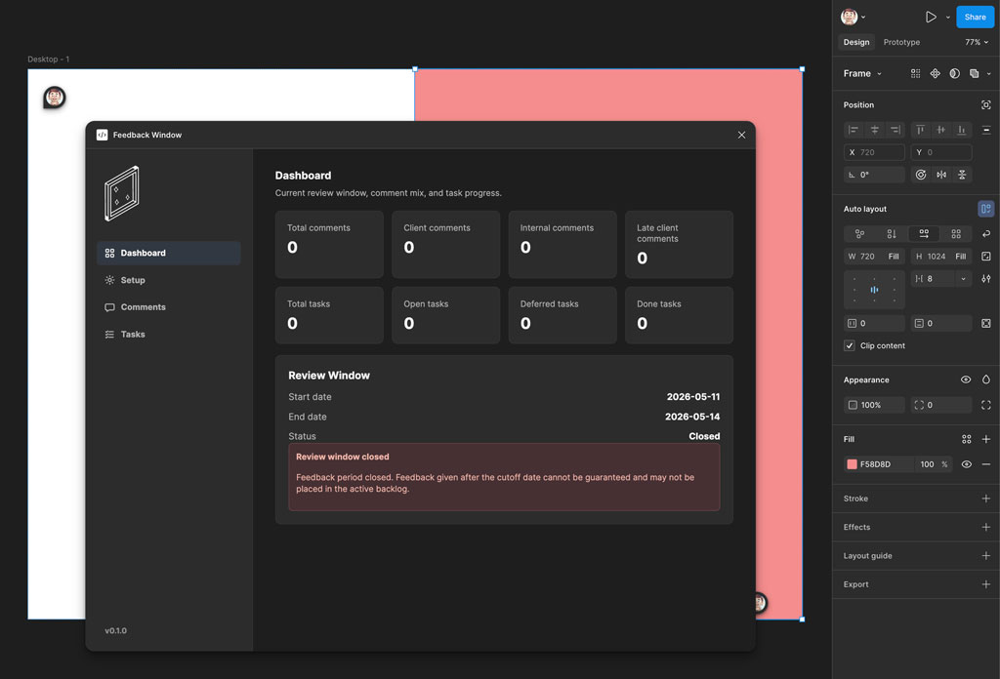

# 🎯 Feedback Window

<p align="center">
  
</p>

<p align="center">
  Turn Figma comments into structured, actionable tasks.
</p>

---

## 🧠 Overview

**Feedback Window** is a Figma plugin designed to help teams manage design feedback intentionally.

Instead of sorting through scattered comments across large files, Feedback Window creates a clear workflow from:

> **Comment → Context → Task → Execution**

It enables teams to focus on the *right feedback*, preserve discussion context, and translate comments into actionable work without losing alignment.

---

## 🚨 The Problem

Figma files often accumulate:
- Comments across multiple pages
- Feedback from different stakeholders
- Notes from different timeframes

This makes it difficult to:
- Focus on the current review window
- Identify late or out-of-scope feedback
- Preserve context from threaded discussions
- Turn comments into structured tasks
- Maintain consistency across teams

---

## ✨ What Feedback Window Does

### 🔍 Focused Comment Intake
- Pull only **active (unresolved)** comments
- Filter by **feedback window (start date → present)**
- Filter by **page**
- Automatically exclude outdated feedback

### 🏷 Feedback Classification
- Identify **On Time vs Late** feedback
- Detect **Client vs Internal** comments
- Apply consistent tags for triage

### 💬 Threaded Context
- Preserve full comment threads
- Expand/collapse replies
- Carry context into task creation

### ✅ Task Creation & Enrichment
- Convert comments into structured tasks
- Add:
  - **Owner**
  - **Notes**
- Maintain deep links back to Figma

### ⚡ Feedback Enforcement
- Reply to late feedback (bulk or per comment)
- Reinforce defined review windows

### 📦 Structured Export
- Export tasks to CSV for Airtable workflows
- Includes:
  - Page location
  - Comment source
  - Timing classification
  - Owner and notes
- Preserves Figma comment links

---

## 🔁 Workflow

1. Define feedback window + team
2. Load scoped, active comments
3. Filter by page or timing
4. Convert comments into tasks
5. Add ownership and notes
6. Export to Airtable for execution

---

## 🎨 Product Experience

- Figma-native UI
- Automatic dark mode support
- Clean visual hierarchy for fast scanning
- Icon-based navigation
- Lightweight, focused interaction model

---

## 🛠 Tech Stack

- Figma Plugin API
- React + TypeScript
- Vite
- Vercel (OAuth + API layer)
- Redis / KV (session handling)

---

## 🚀 Getting Started (Local Development)

1. Clone the repository:
```bash
git clone https://github.com/YOUR_USERNAME/feedback-window.git
cd feedback-window
```

2. Install dependencies:
```bash
npm install
npm run build
```

3. Build the plugin:
```bash
npm run build
```

4. In Figma:
Go to Plugins → Development → Import plugin from manifest
Select manifest.json
Run the plugin from Figma

---

## 🔐 Environment Setup

- FIGMA_CLIENT_ID
- FIGMA_CLIENT_SECRET
- FIGMA_REDIRECT_URI
- FIGMA_OAUTH_SCOPES
- KV_REST_API_URL
- KV_REST_API_TOKEN

These are used for:
- Figma OAuth authentication
- Comment retrieval
- Session storage

---

## 🧪 Development Notes

- Plugin UI runs locally via dist/
- API routes are hosted on Vercel
- OAuth requires valid redirect URI matching your environment
- Preview vs Production environments can use separate Figma apps

---

## 📦 Version

v1.0.0
Initial release supporting a full feedback workflow from intake to task export.
